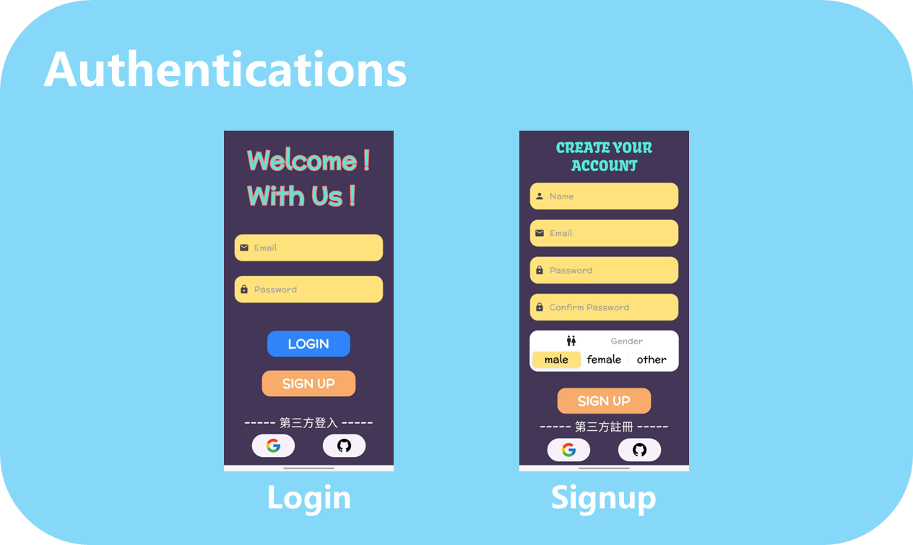

# Avec Moi With Us
An application for recommend movies/tvs.


## Product's Primary Features
* Authentication via Third-Party (Google, GitHub)
* Recommend movies/tvs for user
* Movies/Tvs list by rank
* List random movies/tvs
* Search movies/tvs
* Gain specific movie/tv information
* Collect movies/tvs user like
* Record movies/tvs has watched
* ...

## User Interface
### Authentication (Login, Signup)


### Primary Feature (Home, Recently Hot, Favorite, Information)


### Setting (Edit Contact, Edit Password, Edit Preference, View History)


### Movies / Tvs (Search, Specific)

## Design Pattern
### MVC ( Model - View - Controller )
    ```
    Project Architecture
    
    ├── models (Model)
    │   ├── ...
    │   ├── ...
    │   ├── ...
    │
    ├── screens (View)
    │   ├── ...
    │   ├── ...
    │   ├── ...
    │
    ├── services (Controller)
    │   ├── ...
    │   ├── ...
    │   ├── ...
    │
    ├── main.dart
    ```
### Model

The Model is a component of the software architecture that represents the data and business logic of an application. It encapsulates the application's core functionality, manages data storage and retrieval, and responds to requests from the Controller. In the context of the Model-View-Controller (MVC) design pattern, the Model is responsible for maintaining the application's state and ensuring the integrity of the data.

### View

The View is a component in the software architecture that represents the user interface (UI) of an application. It is responsible for presenting data to the user and receiving user input. In the MVC pattern, the View receives updates from the Model and displays the information in a way that is understandable to the user. It is decoupled from the application's logic, ensuring a separation of concerns.

### Controller

The Controller is a component in the software architecture that handles user input and updates the Model accordingly. It acts as an intermediary between the View and the Model, processing user actions and updating the application's state. In MVC, the Controller responds to user interactions, such as button clicks or input changes, and communicates with the Model to implement the necessary business logic. It helps maintain the separation of concerns and promotes modularity in software design.
